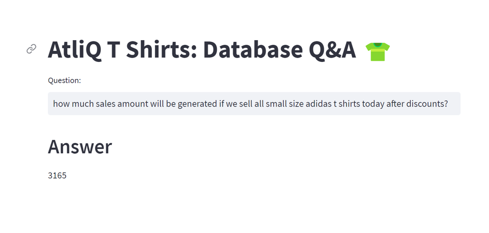

# SQL T-Shirt Store Assistant

This is a natural-language SQL assistant for a T-shirt inventory database. I used LangChain, Google PaLM, few-shot prompting, embeddings, ChromaDB, MySQL, and Streamlit to let a user ask business questions in plain English.



## Project Highlights

- Converts user questions into MySQL queries.
- Uses few-shot examples to guide better SQL generation.
- Connects to a local MySQL database.
- Shows the final answer in a Streamlit UI.

## Setup

```bash
pip install -r requirements.txt
cp .env.example .env
```

Add your Google API key in `.env`.

For database setup, run `database/db_creation_atliq_t_shirts.sql` in MySQL Workbench.

## Run

```bash
streamlit run main.py
```

## Sample Questions

- How many total T-shirts are left in stock?
- How many Nike XS white T-shirts are available?
- What is the total inventory value for all S-size T-shirts?
- How much sales amount will be generated if all small Adidas shirts are sold today after discounts?

## Files

- `main.py` - Streamlit UI.
- `langchain_helper.py` - LangChain SQL chain logic.
- `few_shots.py` - Few-shot examples for SQL generation.
- `database/db_creation_atliq_t_shirts.sql` - MySQL database setup script.
- `.env.example` - Sample environment file.
